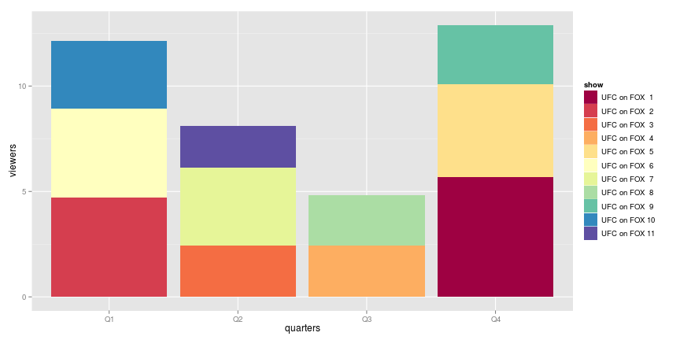

A Simple Analysis of UFC on Fox Viewership
========================================================

Data retrieved from:

Viewer/Ratings Numbers from [mmapayout](http://mmapayout.com/2014/04/ufc-on-fox-11-overnight-rating-1-99m-viewers/)

Event Names from [wikipedia](http://en.wikipedia.org/wiki/UFC_on_Fox)

## Preparation

First we have to load the data and massage it a little to make it easier to
work with:


```r
library(lubridate)
library(ggplot2)
library(gtools)
library(forecast)
library(plyr)

ratings <- read.csv("ratings.csv")
ratings$id <- 1:nrow(ratings)
ratings$date <- as.Date(ratings$date)
ratings$viewers_quartiles <- as.numeric(quantcut(ratings$viewers))
ratings$rating_quartiles <- as.numeric(quantcut(ratings$rating))
ratings$quarters <- quarters(as.Date(ratings$date))
ratings$month <- month(as.Date(ratings$date))
ratings$year <- year(as.Date(ratings$date))

ratings <- merge(ratings, ddply(ratings, "quarters", summarize, quarters.viewers = sum(viewers)), 
    by = "quarters")


head(ratings)
```

```
##   quarters          show viewers rating       date id viewers_quartiles
## 1       Q1 UFC on FOX  2    4.70    2.6 2012-01-28  2                 4
## 2       Q1 UFC on FOX  6    4.22    2.4 2013-01-26  6                 3
## 3       Q1 UFC on FOX 10    3.22    1.9 2014-01-25 10                 2
## 4       Q2 UFC on FOX  3    2.42    1.5 2012-05-12  3                 1
## 5       Q2 UFC on FOX  7    3.70    2.2 2013-04-20  7                 3
## 6       Q2 UFC on FOX 11    1.99    0.8 2014-04-19 11                 1
##   rating_quartiles month year quarters.viewers
## 1                4     1 2012            12.14
## 2                3     1 2013            12.14
## 3                2     1 2014            12.14
## 4                1     5 2012             8.11
## 5                3     4 2013             8.11
## 6                1     4 2014             8.11
```


This is what it looks like when we plot viership by date, add a loess smoothed fit, and color code based on quartile:


```r
ggplot(ratings, aes(x = date, y = viewers)) + geom_histogram(aes(fill = viewers_quartiles), 
    stat = "identity") + geom_smooth(method = "loess") + geom_text(aes(label = show), 
    angle = 90, hjust = -0.05, size = 4) + ylab("Viewers (in millions)") + xlab("Date of Show") + 
    ggtitle("Viewership of UFC On Fox Shows")
```

 


For fun, let's just plot by viewing quarter, they're stable (and low) for their 
big thanksgiving show, declining in Q2 slightly, Q1 is a pretty drastic drop, 
and Q4 is pretty drastic :


```r
ggplot(ratings, aes(x = id, y = viewers, xmin = 0)) + geom_histogram(aes(fill = viewers_quartiles), 
    stat = "identity") + facet_wrap(~quarters) + geom_text(aes(label = show, 
    y = 2), angle = 90, size = 4) + geom_smooth(method = "lm", se = FALSE) + 
    xlab("Event Number") + ylab("Viewers (in Millions)")
```

 


If we stack them up by quarter, how obvious is the trend?


```r
ggplot(ratings, aes(x = quarters, y = viewers)) + geom_histogram(aes(fill = show), 
    stat = "identity") + scale_fill_brewer(palette = "Spectral")
```

 


The bubble plot definitely shows a clear trend when we graph across the 
full timeline:


```r
ggplot(ratings, aes(x = date, y = viewers, size = viewers)) + geom_point(aes(fill = factor(viewers_quartiles)), 
    guide = FALSE, shape = 21) + scale_size(trans = "log2", range = c(2, 20)) + 
    guides(size = FALSE) + xlab("Date of Event") + ylab("Number of Viewers (in millions)") + 
    ggtitle("UFC on Fox events, by Viewership, by Viewer Quartile")
```

 


If we break it down by year, it gets even more brutal:


```r
ggplot(ratings, aes(x = factor(month), y = viewers, size = viewers)) + geom_point(aes(fill = factor(viewers_quartiles)), 
    guide = FALSE, shape = 21) + scale_size(trans = "log2", range = c(2, 20)) + 
    guides(size = FALSE) + xlab("Date of Event") + ylab("Number of Viewers (in millions)") + 
    ggtitle("UFC on Fox events, by Viewership, by Viewer Quartile") + facet_wrap(~year)
```

 


So, let's use some fun tools, let's use the forecast package. It's not a good
sign when the forecast package actually predicts values below zero:


```r
myts <- ts(ratings$viewers, frequency = 4, start = ratings[1, "date"])

fit <- HoltWinters(myts)
preds <- forecast(fit, nrow(ratings))
plot(preds, ylim = c(-1, 8))
```

 


TODO:

* Add variables for the "draw" value of main and co-main event
* Find data set for bellator during this same time period
* Find data set for PPV data to overlay
* Get someone to contribute to this :)
