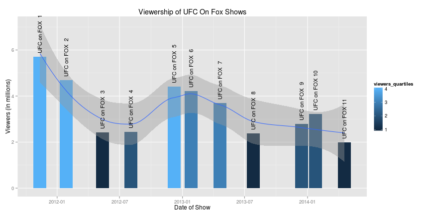
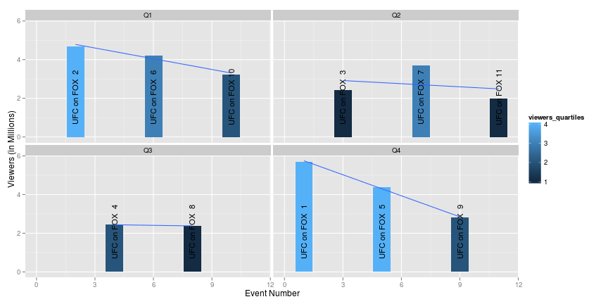

A Simple Analysis of UFC on Fox Viewership
========================================================

Data retrieved from:

Viewer/Ratings Numbers from [mmapayout](http://mmapayout.com/2014/04/ufc-on-fox-11-overnight-rating-1-99m-viewers/)

Event Names from [wikipedia](http://en.wikipedia.org/wiki/UFC_on_Fox)

## Preparation

First we have to load the data and massage it a little to make it easier to
work with:


```r
library(lubridate)
library(ggplot2)
library(gtools)
library(forecast)
library(plyr)

ratings <- read.csv("ratings.csv")
ratings$id <- 1:nrow(ratings)
ratings$date <- as.Date(ratings$date)
ratings$overall_viewers_quartiles <- as.numeric(quantcut(ratings$viewers))
# ratings$rating_quartiles <- as.numeric(quantcut(ratings$rating))
ratings$quarters <- quarters(as.Date(ratings$date))
ratings$month <- month(as.Date(ratings$date))
ratings$year <- year(as.Date(ratings$date))

ratings <- merge(ratings, ddply(ratings, "quarters", summarize, quarters.viewers = sum(viewers)), 
    by = "quarters")

ufc_ratings <- subset(ratings, promotion == "ufc")
ufc_ratings$viewers_quartiles <- as.numeric(quantcut(ufc_ratings$viewers))
ufc_ratings <- ufc_ratings[with(ufc_ratings, order(id)), ]
```


UFC Ratings
===================

Let's just get a raw summary of viewership data:


```r
summary(ufc_ratings$viewers)
```

```
##    Min. 1st Qu.  Median    Mean 3rd Qu.    Max. 
##    1.99    2.43    3.22    3.45    4.31    5.70
```

This is what it looks like when we plot viership by date, add a loess smoothed fit, and color code based on quartile:


```r
ggplot(ufc_ratings, aes(x = date, y = viewers)) + geom_histogram(aes(fill = viewers_quartiles), 
    stat = "identity") + geom_smooth(method = "loess") + geom_text(aes(label = show), 
    angle = 90, hjust = -0.05, size = 4) + ylab("Viewers (in millions)") + xlab("Date of Show") + 
    ggtitle("Viewership of UFC On Fox Shows")
```

 


As you see in the graph above, the fill color is getting darker the further
we get to the current date on the x axis, the darker the fill means the lower
the quartile, the closer we get to current day, the lower the events rank. You'll
also note that the most recent events actually underperform the loess fit line,
so they are actually performing worse than a regression would estimate.

For fun, let's just plot by viewing quarter, they're stable (and low) for their 
big thanksgiving show, declining in Q2 slightly, Q1 is a pretty drastic drop, 
and Q4 is pretty drastic :


```r
ggplot(ufc_ratings, aes(x = id, y = viewers, xmin = 0)) + geom_histogram(aes(fill = viewers_quartiles), 
    stat = "identity") + facet_wrap(~quarters) + geom_text(aes(label = show, 
    y = 2), angle = 90, size = 4) + geom_smooth(method = "lm", se = FALSE) + 
    xlab("Event Number") + ylab("Viewers (in Millions)")
```

 


This shows that there definitely was a level of seasonality during the first few
offerings of the UFC on Fox, however the seasonal potential bump has been leveled.
This could be caused by a number of interesting socialogical reasons, my personal
guess is that the seasonal bump has leveled due to hardcores innability to 
re-convince their families that tuning in was a worthwhile endeavor. If you will
the "newness" has worn off.

If we stack them up by quarter, how obvious is the trend?


```r
ggplot(ufc_ratings, aes(x = quarters, y = viewers)) + geom_histogram(aes(fill = show), 
    stat = "identity") + scale_fill_brewer(palette = "Spectral")
```

 


While the 4th quarter (the end of the year show) is still the king, it will
be interesting to see if the stacked segments continue to grow smaller the higher
up we go up the chart.

The bubble plot definitely shows a clear trend when we graph across the 
full timeline:


```r
ggplot(ufc_ratings, aes(x = date, y = viewers, size = viewers)) + geom_point(aes(fill = factor(viewers_quartiles)), 
    guide = FALSE, shape = 21) + scale_size(trans = "log2", range = c(2, 20)) + 
    guides(size = FALSE) + xlab("Date of Event") + ylab("Number of Viewers (in millions)") + 
    ggtitle("UFC on Fox events, by Viewership, by Viewer Quartile")
```

 

Bigger bubbles at the top left show us that when we started, there was definitely
buzz and promise to the UFC on Fox shows, buht a clear downward trend as we get
closer to current day is clear, including the same effect of coloring by quartile.

If we break it down by year, it gets even more brutal:


```r
ggplot(ufc_ratings, aes(x = factor(month), y = viewers, size = viewers)) + geom_point(aes(fill = factor(viewers_quartiles)), 
    guide = FALSE, shape = 21) + scale_size(trans = "log2", range = c(2, 20)) + 
    guides(size = FALSE) + xlab("Date of Event") + ylab("Number of Viewers (in millions)") + 
    ggtitle("UFC on Fox events, by Viewership, by Viewer Quartile") + facet_wrap(~year)
```

 


There is no question that as the years pass, the height and size of the bubbles
is shrinking.

So, let's use some fun tools, let's use the forecast package. It's not a good
sign when the forecast package actually predicts values below zero:


```r
myts <- ts(ufc_ratings$viewers, frequency = 4, start = min(ufc_ratings$date))

fit <- HoltWinters(myts)
preds <- forecast(fit, nrow(ufc_ratings))
plot(preds, ylim = c(-1, 8))
```

 


The forecast takes into account some level of seasonality, and of course any 
number of interventions by Zuffa management and Fox can change this, but a 
simple numerical forecast shows that the current trends leave most of the 
probability of viewership pretty unchanged. The question is will FOX stop airing
if ratings hit the lower bound of the probability distribution of the forecast.

Bellator Ratings
==============================

For fun, I collected the data for the Bellator events during the same time
period. Let's see what that data looks like!


```r

bellator_ratings <- subset(ratings, promotion == "bellator")
bellator_ratings$viewers_quartiles <- as.numeric(quantcut(bellator_ratings$viewers))
bellator_ratings <- bellator_ratings[with(bellator_ratings, order(id)), ]
```


Let's just get a raw summary of viewership data:


```r
summary(bellator_ratings$viewers)
```

```
##    Min. 1st Qu.  Median    Mean 3rd Qu.    Max. 
##   0.105   0.167   0.520   0.476   0.718   1.100
```


This is what it looks like when we plot viership by date, add a loess smoothed fit, and color code based on quartile:


```r
ggplot(bellator_ratings, aes(x = date, y = viewers)) + geom_histogram(aes(fill = factor(viewers_quartiles)), 
    stat = "identity") + geom_smooth(method = "loess") + geom_text(aes(label = show), 
    angle = 90, hjust = -0.05, size = 4) + ylab("Viewers (in millions)") + xlab("Date of Show") + 
    ggtitle("Viewership of Bellator Shows")
```

 


But there's something really obvious happening here, what's the difference between the first 
part of the graph, and the second part? 


```r
ggplot(bellator_ratings, aes(x = date, y = viewers)) + geom_histogram(aes(fill = factor(network)), 
    stat = "identity") + geom_smooth(method = "loess") + geom_text(aes(label = show), 
    angle = 90, hjust = -0.05, size = 4) + ylab("Viewers (in millions)") + xlab("Date of Show") + 
    ggtitle("Viewership of Bellator Shows Color Coded by Network")
```

 


Bellator's Switch to SpikeTV in 2013 saw a serious change in the audience reach!

People sure do love bubble plots, and the UFC one showed a pretty clear
declining trend. Let's do the same thing for the Bellator Viewership
Data:


```r

ggplot(bellator_ratings, aes(x = date, y = viewers, size = viewers)) + geom_point(aes(fill = factor(viewers_quartiles)), 
    guide = FALSE, shape = 21) + scale_size(trans = "log2", range = c(2, 20)) + 
    guides(size = FALSE) + xlab("Date of Event") + ylab("Number of Viewers (in millions)") + 
    ggtitle("Bellator events, by Viewership, by Viewer Quartile")
```

 


Same thing with the forecast package! What's Bellator's Current Trend?

let's use the forecast package. It's not a good
sign when the forecast package actually predicts values below zero:


```r
myts <- ts(bellator_ratings$viewers, frequency = 4, start = min(bellator_ratings$date))

fit <- HoltWinters(myts)
preds <- forecast(fit, nrow(ufc_ratings))
plot(preds, ylim = c(-0, 2))
```

 


TODO:

* Add variables for the "draw" value of main and co-main event
* Find data set for bellator during this same time period
* Find data set for PPV data to overlay
* Get someone to contribute to this :)
